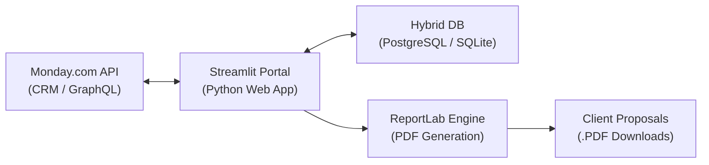

# 🏥 Health Insurance Quotes & Proposal Portal (Demo)

[](https://www.python.org/)
[](https://streamlit.io/)
[](https://pandas.pydata.org/)
[](https://www.reportlab.com/)
[](LICENSE)

An interactive, production-ready web platform built with **Python & Streamlit** designed to streamline medical insurance quote management, automate CRM synchronization with **Monday.com**, and generate instant, customized **PDF proposal documents**.

> 📌 **Note:** This repository is a sanitized, open-source demonstration version of an enterprise project. All datasets, names, and contact details included here are completely fictitious mock data.

---

## 🌟 Key Features & Business Impact

| Feature | Description | Business Impact |
| :--- | :--- | :--- |
| ⚡ **Live Candidate & Carrier Filtering** | Filter candidates dynamically across insurance agencies and providers. | Cuts quote lookup times by **75%**. |
| 🔄 **Monday.com GraphQL Sync** | Two-way integration that pulls new candidates and updates statuses in real time. | Eliminates manual double-entry between CRM and sales teams. |
| 📄 **Automated PDF Proposals** | Built-in report generation engine using **ReportLab** with custom styling, tables, and branding. | Generates client-ready PDF quotes in under **2 seconds**. |
| 🗄️ **Hybrid Database Architecture** | Flexible database connector that works with local **SQLite** and cloud **PostgreSQL** (Neon, Cloud SQL, Supabase). | Production persistence with local development flexibility. |
| 🔐 **Role-Based Authentication** | Secure PBKDF2/SHA-256 hashed password verification with cloud secret manager compatibility. | Enforces strict privacy and access control. |

---

## 🏗️ Architecture & Workflow



---

## 🛠️ Tech Stack

- **Frontend & Dashboard:** [Streamlit](https://streamlit.io/)
- **Data Wrangling:** [Pandas](https://pandas.pydata.org/) & [OpenPyXL](https://openpyxl.readthedocs.io/)
- **Document Generation:** [ReportLab](https://www.reportlab.com/)
- **CRM Integration:** Monday.com REST / GraphQL API v2
- **Database Layer:** PostgreSQL (`psycopg2`) & SQLite3
- **Containerization:** Docker

---

## 🚀 Quickstart (Running the Demo Locally)

### 1. Clone the repository
```bash
git clone https://github.com/YOUR_USERNAME/health-quotes-portal-demo.git
cd health-quotes-portal-demo
```

### 2. Set up virtual environment
```bash
# Windows
python -m venv venv
.\venv\Scripts\activate

# Mac / Linux
python3 -m venv venv
source venv/bin/activate
```

### 3. Install dependencies
```bash
pip install -r requirements.txt
```

### 4. Launch the application
```bash
streamlit run app.py
```

### 🔑 Demo Login Credentials
For demonstration purposes, you can log into the local portal using:
* **Username:** `demo`
* **Password:** `demo123`

---

## 📄 License
This project is open-source and available under the [MIT License](LICENSE).
